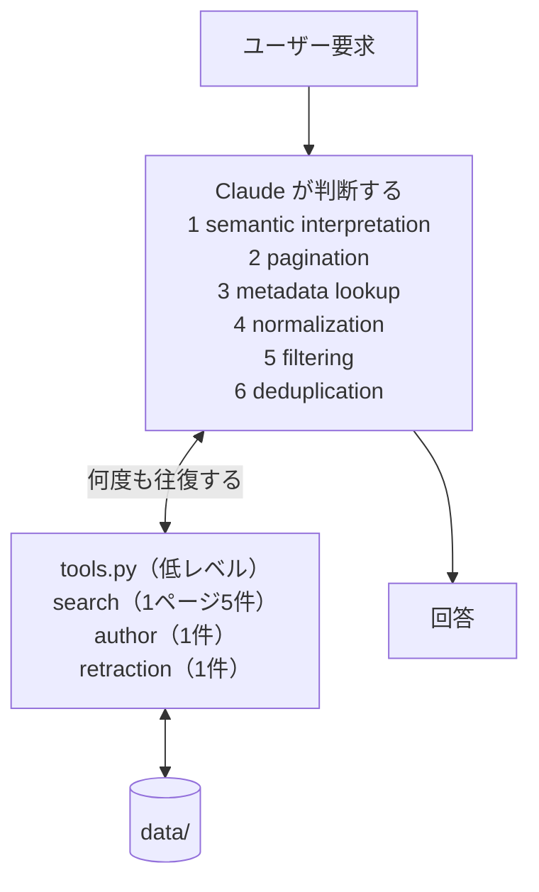
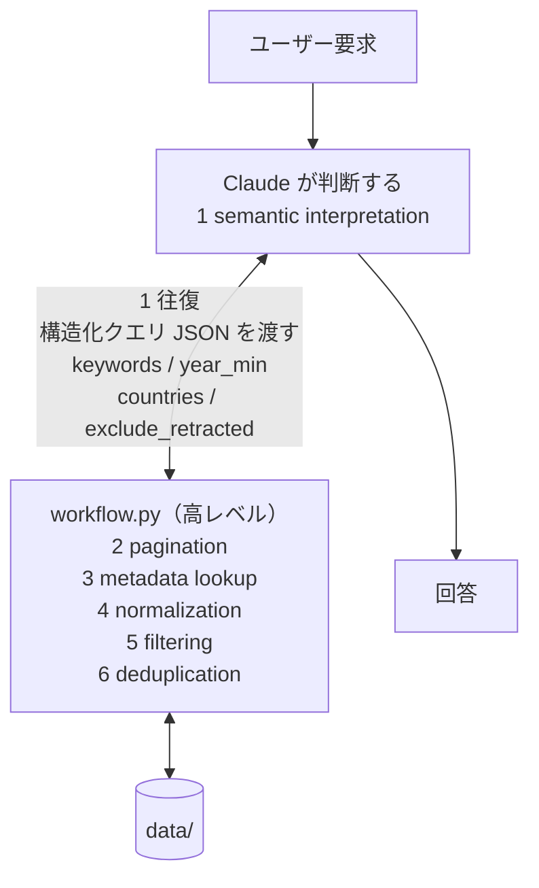

# ハンズオン

「LLM に任せる処理」と「Python の function / workflow に落とす処理」を自分で決めて実装するハンズオン。

| Step | やること |
| --- | --- |
| [1](#step-1--agentic-版を動かす) | `agentic` ブランチで Claude に要求を投げる |
| [2](#step-2--責務を振り分ける) | 6 つの処理と 3 つの判断を LLM / Python に振り分ける |
| [3](#step-3--実装させる) | 決めた境界を Claude に実装させる |
| [4](#step-4--処理の違いを見る) | 改善前と改善後を 1 回ずつ動かして比べる |
| [5](#step-5--解答例を見る) | `deterministic` ブランチと自分の設計を比べる |

## ルール

- `data/` の中身は見ない。参加者も Claude も、用意された CLI 経由でのみ触る
- このファイルと `README.md` はエージェントから読めないように設定済み。指示は下のプロンプトをコピペで渡す
- エージェントは Claude Code / Codex のどちらでもよい（[使い分け](#claude-code-以外を使う場合)）
- Step 1 / 3 は**新しいセッションで始める**（下記）。Step 4 はターミナルでの実行のみ
- 依存は Python 3 標準ライブラリのみ

## Claude Code 以外を使う場合

| | Claude Code | Codex |
| --- | --- | --- |
| 起動 | `claude` | `codex` |
| ルールを読むファイル | `CLAUDE.md`（`AGENTS.md` を import） | `AGENTS.md` |
| 設定ファイル | `.claude/settings.json` | `.codex/config.toml` |
| セッションを変える | `/clear` | `/new`（または再起動） |
| Step 4 の測定 | `./compare-claude.sh "<cmd>"` | `./compare-codex.sh "<cmd>"` |
| やりとり回数の計測 | できる | できない（時間と結果のみ） |
| `data/` の読み取り禁止 | `.claude/settings.json` で**強制** | 指示のみ（強制されない） |

Codex には特定ファイルの読み取りを禁止する設定がありません。
`data/` / `WORKSHOP.md` / `README.md` を見ないことは `AGENTS.md` の指示に依存します。
`.codex/config.toml` で固定してあるのは書き込み範囲（`workspace-write`）と
外向き通信の遮断（`network_access = false`）だけです。

`.codex/` はプロジェクトを trust したときのみ読み込まれます。初回起動時に trust を求められたら承認してください。

## セッションを変える（各 Step の前に必ず行う）

Claude Code が動いている画面で `/clear` と打つ（Codex は `/new`）。会話履歴が捨てられ、
Claude は**それまでのやりとりを何も覚えていない状態**になる。

```
> /clear
```

`claude` を Ctrl+C で終了して再起動しても同じ。

- Step 1 で Claude が取得した論文・著者のデータは、そのセッションに残り続ける
- 履歴が残ったまま Step 3 に進むと、Claude は**答えを知った状態で実装する**
- **ファイルは `/clear` では消えない。** Step 3 の前は作業ツリーの掃除も必要（[Step 3 の準備](#準備)）

確認方法: `/clear` の後に「さっきの続きで」と言っても Claude に通じない状態が正しい。

## ユーザー要求（全 Step 共通）

> 2024年以降に公開された Agent 関連の論文で、日本の研究機関に所属する著者が含まれ、
> retracted ではない論文をすべて取得してください

---

# Step 1 — agentic 版を動かす



### 実行

```bash
git checkout agentic
python3 tools.py --help
claude
```

### 貼るプロンプト

```
このリポジトリの tools.py が提供するインターフェースだけを使って、次の要求に答えてください。

「2024年以降に公開された Agent 関連の論文で、日本の研究機関に所属する著者が含まれ、
retracted ではない論文をすべて取得してください」

制約:
- 用意されたインターフェース（python3 tools.py の各サブコマンド）だけを使うこと
- data/ の中身を直接見ないこと（cat / Read / grep / python どの手段でも）
- tool / CLI の内部実装を読んで答えを導かないこと
- 他ブランチや解答例（git show / git diff など）を見ないこと
- WORKSHOP.md / README.md を読まないこと
- 要求を満たす結果を「すべて」取得すること（取りこぼしがないこと）

最終出力は paper_id のリストと、各件がなぜ条件を満たすかの 1 行説明にしてください。
```

実行ログで、Claude が判断した箇所を確認する（取得ページ数 / 引いた著者 / `country` の表記揺れの扱い / 重複の寄せ方 / "Agent" を含むが LLM エージェント研究でない論文の扱い）。

---

# Step 2 — 責務を振り分ける

6 つの処理を「LLM に残す」か「Python に移す」か決めて、表を埋める。

| # | 処理 | 処理内容 | LLM / Python | 理由 |
|---|---|---|---|---|
| 1 | semantic interpretation | 自然言語の要求を検索条件に変換する（「Agent 関連」→ 検索語、「日本の研究機関」→ 判定基準、「2024年以降」→ 年の下限） | | |
| 2 | pagination | 1 ページ 5 件しか返らない検索を最終ページまで辿り、母集団を全件そろえる | | |
| 3 | metadata lookup | 論文が持つ `author_ids` を使って、著者 1 件ずつの所属情報を引く | | |
| 4 | normalization | `country`（`JP` / `Japan` / `jp` / 空文字 / `null`）と所属文字列を突き合わせ、日本かどうかを判定できる形に揃える | | |
| 5 | filtering | 年の下限、日本所属著者の有無、`retracted`（DOI でのみ判定可）を条件に除外する | | |
| 6 | deduplication | 同一論文の重複レコードを 1 件に畳み、どれを代表として残すか決める | | |

4〜6 は、それだけでは決まらない。**判断の中身**を誰が持つかも同じ問いで決める。

| # | 判断 | 中身 | LLM / Python | 理由 |
|---|---|---|---|---|
| 7 | 何が日本の機関か | 「RIKEN」「Osaka University」が日本の機関だという知識。その一覧を誰が持つか（4 が依存する） | | |
| 8 | この論文は Agent 関連か | 検索語で拾えた論文が、要求の意味で「Agent 関連」かどうかの可否判定（5 が依存する） | | |
| 9 | この 2 件は同じ論文か | DOI が違う preprint と査読版のように、表記だけでは同一性が決まらない場合の判定（6 が依存する） | | |

### 判定の基準

答え合わせに使える基準が 1 つある。

> **LLM が毎回出力するものが、データ件数に比例して増えるなら、その処理は移っていない。**

| 7〜9 を | LLM 側にすると | Python 側にすると |
| --- | --- | --- |
| LLM の出力 | 論文数・著者数に比例して増える | 検索条件 1 個。12 件でも 1200 件でも同じ |
| 判断の量 | 減らない | 減る |

処理をパイプラインの形にしただけでは移ったことになりません。

---

# Step 3 — 実装させる

決めるのは責務の境界だけ。JSON の形・関数名・ファイル構成は Claude に任せる。

### 準備

```bash
git status --short                          # 何が残っているか確認
git checkout -b improve-<yourname> agentic  # 自分の改善用ブランチ
git clean -fd && git restore .              # やり直すとき。残骸を消す
```

ここで **`/clear`**（[セッションを変える](#セッションを変える各-step-の前に必ず行う)）してから、次のプロンプトを貼る。

### 貼るプロンプト

まず①をコピペし、続けて②を貼る。②で終わるので、途中を書き換える必要はない。

**① 指示（そのままコピペ）**

```
私が決めた責務分担のとおりに実装してください。境界を決めるのは私、実装するのはあなたです。

## あなたが決めてよいこと
- LLM と Python の間で受け渡すデータの形（構造化クエリなど）
- 関数名 / ファイル構成 / 出力フォーマット

## 制約（厳守）
- 末尾の責務分担をそのまま実装すること。境界について別案を提案・追記しないこと
- 私が「LLM」と書いた処理を Python 側へ、「Python」と書いた処理を LLM 側へ勝手に動かさないこと
- 責務分担に曖昧さがあれば、勝手に決めずに質問すること
- data/ の中身を直接確認しないこと
- 既存 tool / CLI の内部実装は、改修に必要な範囲を超えて読まないこと。実装から答えを逆算しないこと
- deterministic ブランチや他ブランチを確認しないこと（git show / git diff / git log -p を使わない）
- WORKSHOP.md / README.md を読まないこと。責務分担はこのプロンプトに書かれたものだけが正しい
- 正解データを探索・推測しないこと。期待結果をハードコードしないこと
- 新しい依存ライブラリを追加しないこと（Python 標準ライブラリのみ）
- この演習に関係ないファイルを変更しないこと

## 実装後に報告すること
1. 変更 / 追加したファイル
2. 各項目をそれぞれどちら側に置いたか
3. 実行方法（コマンド 1 行）

## 責務分担（これが唯一の正しい設計）
```

**② 責務分担（選ばなかった側を消してから、①の続きに貼る）**

```
処理
1. semantic interpretation（自然言語の要求 → 検索条件）              … LLM / Python
2. pagination（全ページ取得）                                        … LLM / Python
3. metadata lookup（著者の所属を引く）                                … LLM / Python
4. normalization（JP / Japan / jp / 空文字 / null の名寄せ）          … LLM / Python
5. filtering（year / retracted の除外）                              … LLM / Python
6. deduplication（重複の畳み込み）                                    … LLM / Python

判断
7. 何が日本の機関か（機関名の一覧を持つ）                             … LLM / Python
8. この論文は Agent 関連か（1 件ごとの可否）                          … LLM / Python
9. この 2 件は同じ論文か（DOI が違う preprint と査読版）              … LLM / Python
```

### 終わったら

```bash
git add -A && git commit -m "my design"
```

チェック項目:

- Claude が境界について別案を出していないか（データの形やファイル名の提案は任せた範囲）
- 報告された行番号が実際と合っているか（`grep -n` で確認）
- 著者 ID や paper_id が直接書かれていないか（例: `japan_author_ids = [a7, a12]`）

---

# Step 4 — 処理の違いを見る

Claude Code の**外**（普通のターミナル）で 1 コマンド実行するだけ。
`/clear` は不要。`git clean` はしない（Step 3 の実装が消える）。

引数に渡すのは、**Step 3 の最後に Claude が報告した「実行方法」**（報告項目の 3 番目）。

```bash
./compare-claude.sh "python3 pipeline.py --query-file query.json"   # Claude Code
./compare-codex.sh  "python3 pipeline.py --query-file query.json"   # Codex
```

`python3 pipeline.py` のような**基本のコマンドだけ**渡せばよい。
引数の詳細や `echo '{...}' |` のような前段は、エージェントが `--help` を見て自分で組む。

改善前と改善後を 1 回ずつ動かして並べる。片側 1〜2 分、合計 2〜3 分かかる。

**どちらもエージェントを通す。** 違うのは渡す道具だけ（`tools.py` か、自分が作った仕組みか）。
出力はこういう形で出る（paper_id は伏せてある）。

```
=== 改善前: claude + tools.py（低レベル） ===
エージェントのやりとり 30 回 / 所要 77 秒
結果: p0.. p0.. p0.. ...

=== 改善後: claude + <あなたの仕組み>（高レベル） ===
エージェントのやりとり 14 回 / 所要 61 秒
結果: p0.. p0.. p0.. ...

結果は同じ。違うのは、エージェントが判断した回数。
```

回数と秒数は解答例での実測値。うまく設計できていれば
**やりとりが減り、時間も減り、結果は変わらない**。

見る箇所:

- **やりとりの回数** … ここが減った分だけコード側に移った。減っていなければ移せていない
  （Codex では回数が取れないので、所要時間と結果で見る）
- **所要時間** … やりとりが減れば減る。増えていたら、判断を残したまま手数を足しただけ
- **結果** … 同じなら、改善で失われたものはない
- 結果が違う場合は、出力の除外理由を読んでどちらが要求に合っているか確認する

参考に、実際に出た失敗例（判断を LLM に残したままパイプライン化した場合）:

```
やりとり 17 回 / 所要 133 秒 / 件数は同じだが重複が畳めていない
```

やりとりは減ったが時間は倍。論文ごとの判断を LLM に出力させ続けたため、
判断の量が減らずパイプラインの手数だけが増えた。

Python 側だけで同じ入力→同じ出力を確かめたい場合（LLM の入力ファイルが不要な設計のときだけ）:

```bash
<実行方法> > /tmp/a.txt && <実行方法> > /tmp/b.txt && diff /tmp/a.txt /tmp/b.txt && echo "一致"
```

---

# Step 5 — 解答例を見る



Step 1 と骨格は同じ。変わるのは **tool の粒度**と、**Claude 側に残る処理**。

### 動かす

```bash
git checkout deterministic

echo '{"keywords":["agent"],"year_min":2024,"countries":["JP"],"exclude_retracted":true}' \
  | python3 workflow.py
```

これが workflow の全入力。Step 4 の「改善後」で Claude がやっていたのは、
この JSON を組み立てて渡し、返ってきた結果を読むことだけ。

### Step 2 の表に対する解答例

<details>
<summary>Step 2 を自分で埋めてから開く（クリックで展開）</summary>

`workflow.py` の実装がどちらを選んでいるか。

| # | 項目 | 解答例 | 実装 |
|---|---|---|---|
| 1 | semantic interpretation | **LLM** | 構造化クエリ JSON を Claude が組む |
| 2 | pagination | Python | `fetch_all()` が最終ページまで辿る |
| 3 | metadata lookup | Python | `author_ids` を全件引く（第 1 著者で止めない） |
| 4 | normalization | Python | `normalize_country()`。判定不能なら推測せず除外 |
| 5 | filtering | Python | `year_min` / `retracted` / `countries` |
| 6 | deduplication | Python | `dedupe()`。DOI と正規化タイトルの両方で畳む |
| 7 | 何が日本の機関か | Python | `ALIASES` と `JP_INSTITUTIONS` をコードに固定 |
| 8 | この論文は Agent 関連か | **LLM** | `keywords` の選び方だけ。コード側に可否判定はない |
| 9 | この 2 件は同じ論文か | Python | 正規化タイトル一致 + 査読版 > preprint で代表を決める |

**LLM に残っているのは 1 と 8 だけ。** 9 項目のうち 7 項目がコード側にある。

8 が LLM 側なのは移し忘れではない。「Agent 関連」に何を含めるかは要求の意味であって、
仕様に書き切ると要求の幅を殺す。1 と 8 は同じことを別の粒度で聞いている
（1 が検索語の選定、8 がその結果の可否）。

自分の表と見比べる箇所:

- 7 を LLM 側にした場合、機関名の一覧は毎回 LLM が書く。網羅性を保証するものは何か
- 8 を Python 側にした場合、「Agent 関連」の定義をコードに書いたことになる。それは仕様か
- 9 を DOI 一致だけにした場合、DOI が違う preprint と査読版は両方残る

</details>

### コードを見る

```bash
git diff agentic..deterministic
```

`tools.py` が消えて `workflow.py` が増えるだけ。上の表で Python 側になった 7 項目が、
この 96 行に入っている。

`deterministic` は唯一の正解ではなく、一つの設計例。

